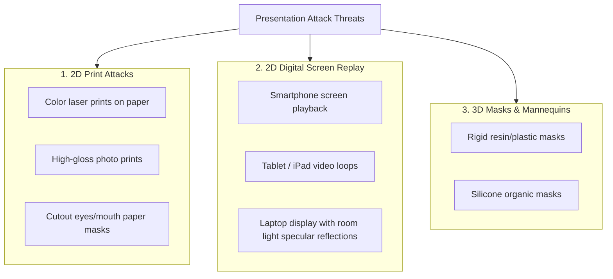
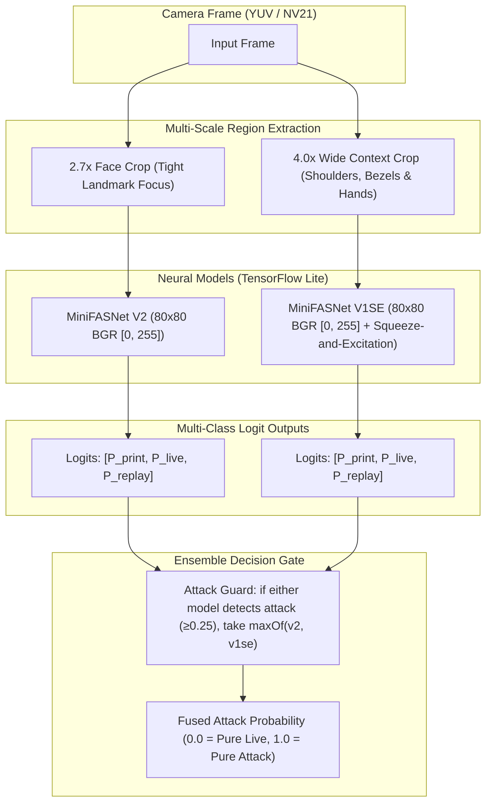
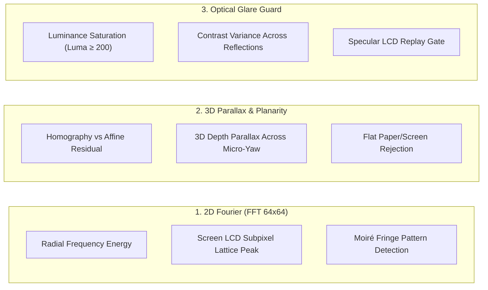
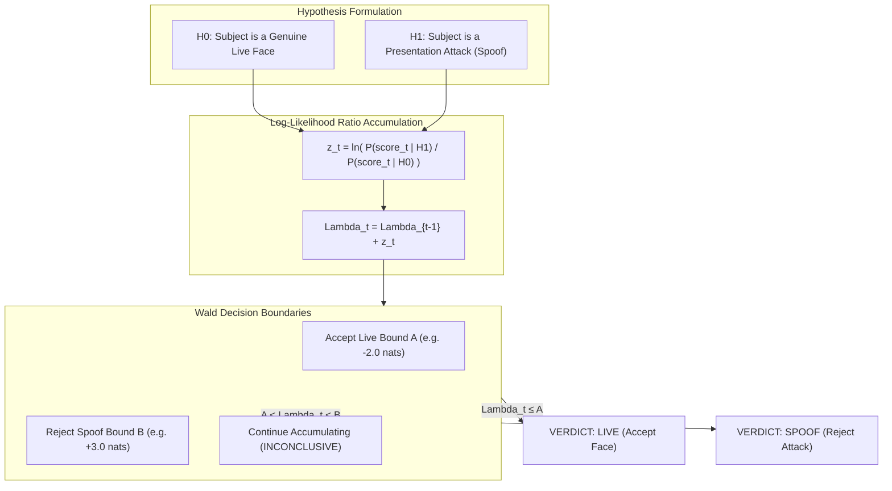
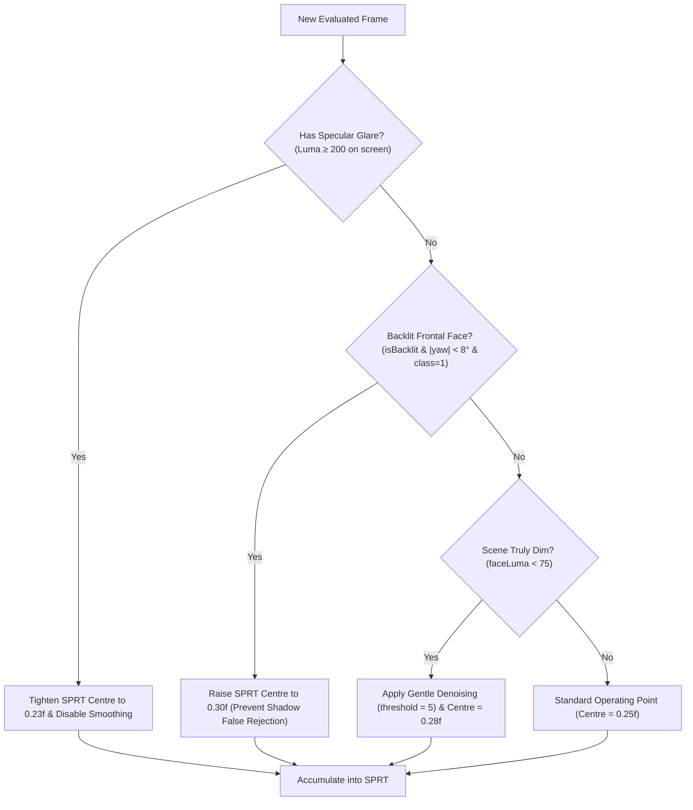

# Multi-Cue Anti-Spoofing & Liveness Detection (PAD)

This document provides a comprehensive technical breakdown of the presentation attack detection (PAD) architecture in **FaceScan**, including deep learning ensembles, 2D Fourier spatial frequency analysis, 3D parallax geometry, and Wald's Sequential Probability Ratio Test (SPRT).

---

## 1. Threat Models & Attack Surfaces

Biometric face scanners face three distinct categories of Presentation Attacks (PA):

---

## 2. Dual-Scale MiniFASNet Neural Ensemble

FaceScan deploys two complementary deep convolutional neural networks based on the MiniVision MiniFASNet architecture:

### The `[0, 255]` Raw Byte Scale Contract
A critical discovery during model reverse-engineering: MiniFASNet models were trained directly on raw byte arrays $[0, 255]$ in BGR channel order.
- **The Trap**: Dividing pixels by $255.0$ (standard deep learning practice) compresses the input into $[0, 1]$, collapsing internal convolution activations and destroying the model's discriminative power ($p_{\text{live}}$ dynamic range collapses from **0.989** down to **0.003**).
- **FaceScan Guarantee**: Inputs are maintained strictly in $[0, 255]$ raw float representation, validated continuously by [`scripts/run_golden_tests.py`](file:///c:/Users/Ayush%20Kumar/Desktop/FaceC/scripts/run_golden_tests.py).

---

## 3. Physical Liveness Cues (Beyond Deep Learning)

To defeat sophisticated attacks that might fool a single neural network, FaceScan combines neural predictions with physical optical cues:

### A. 2D Discrete Fast Fourier Transform (FFT 64x64)
LCD, OLED, and tablet screens feature microscopic RGB subpixel grids. When photographed by a camera, this grid produces high-frequency spatial periodicity (moiré fringes).
- The native pipeline computes a 2D FFT on a central $64 \times 64$ patch.
- Natural human skin exhibits smooth, decaying $1/f^\alpha$ power spectra.
- Digital displays show sharp, concentrated frequency peaks outside the organic skin power spectrum, instantly triggering spoof suspicion.

### B. 3D Parallax & Homography vs. Affine Residuals
Under natural micro-movements of the head (1° to 4° of yaw or pitch):
- A **flat 2D photo or laptop screen** can be modeled almost perfectly by a planar homography ($H \in \mathbb{R}^{3 \times 3}$). The residual reprojection error between the homography and an affine transformation is near zero ($\approx 0.00 \text{ px}$).
- A **genuine 3D human face** has prominent non-planar relief (nose bridge, eye sockets, cheekbones). When the head rotates even 2°, parallax creates substantial non-planar displacement ($> 0.38 \text{ px}$ residual), orders of magnitude above the planar floor.

---

## 4. Sequential Probability Ratio Test (SPRT)

Single-frame anti-spoof decisions are vulnerable to transient noise. FaceScan implements **Abraham Wald's Sequential Probability Ratio Test (SPRT)** in [`LivenessFusion.kt`](file:///c:/Users/Ayush%20Kumar/Desktop/FaceC/node_modules/react-native-face-detector-camera/android/src/main/java/com/facedetectorcamera/pipeline/LivenessFusion.kt).

### Mathematical Formulation
For each frame $t$, the log-likelihood ratio $z_t$ is computed from the calibrated attack score relative to an adaptive centre $c$:

$$z_t \approx k \cdot (\text{score}_t - c)$$

where:
- When $\text{score}_t < c$, $z_t$ is negative, moving $\Lambda_t$ downward toward the **Live Accept Bound** ($A = -2.0$).
- When $\text{score}_t > c$, $z_t$ is positive, driving $\Lambda_t$ upward toward the **Spoof Reject Bound** ($B = +3.0$).

---

## 5. Edge-Case Engineering & Safety Gates

Real-world deployments encounter challenging conditions that standard algorithms fail on. FaceScan incorporates three mission-critical safeguards:

### 1. Laptop Screen Specular Glare Protection
- **Problem**: When a laptop screen reflects a desk lamp or ceiling light, the intense specular glare washes out LCD moiré lines in the reflection zone, causing naive filters to mistake the reflection for natural light on human skin.
- **Solution**: The `ScreenReflectionGuard` detects saturated pixels ($\text{luma} \ge 200$). If detected, bilateral denoising is immediately disabled, and the SPRT centre tightens from $0.25$ to **$0.23$**, firmly rejecting screen replays.

### 2. Backlit Frontal Face Verification
- **Problem**: In rooms with bright background windows or overhead backlights, deep shadows fall across the eye sockets and nose. When looking straight at the camera ($yaw \approx 0^\circ$), bilateral symmetry makes the face look like a dark 2D paper cutout, causing standard algorithms to stall.
- **Solution**: When `isBacklit && abs(yaw) < 8°` and MiniFASNet's primary classification is `LIVE (Class 1)`, the centre adapts to **$0.30$**, allowing the student to verify in 0.3 seconds.

### 3. Refined Gentle Denoising ($\text{threshold} = 5$)
- **Problem**: High-ISO sensor shot noise in dim rooms can degrade neural classification. However, standard bilateral filters (threshold $\ge 18$) blur out LCD subpixels, accidentally making screens look like smooth human skin.
- **Solution**: FaceScan uses a gentle bilateral range threshold of **$5$**. This eliminates $\pm 2$ sensor shot noise grain while preserving sharp screen grid lines.
