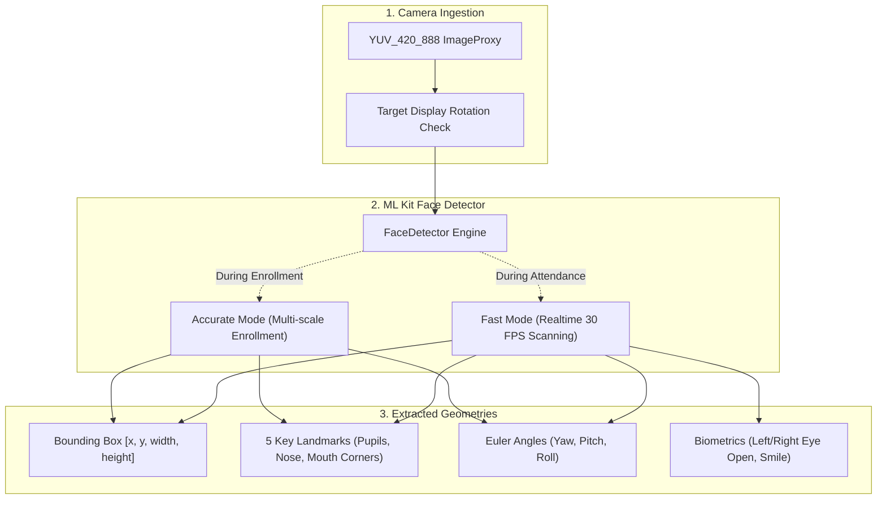
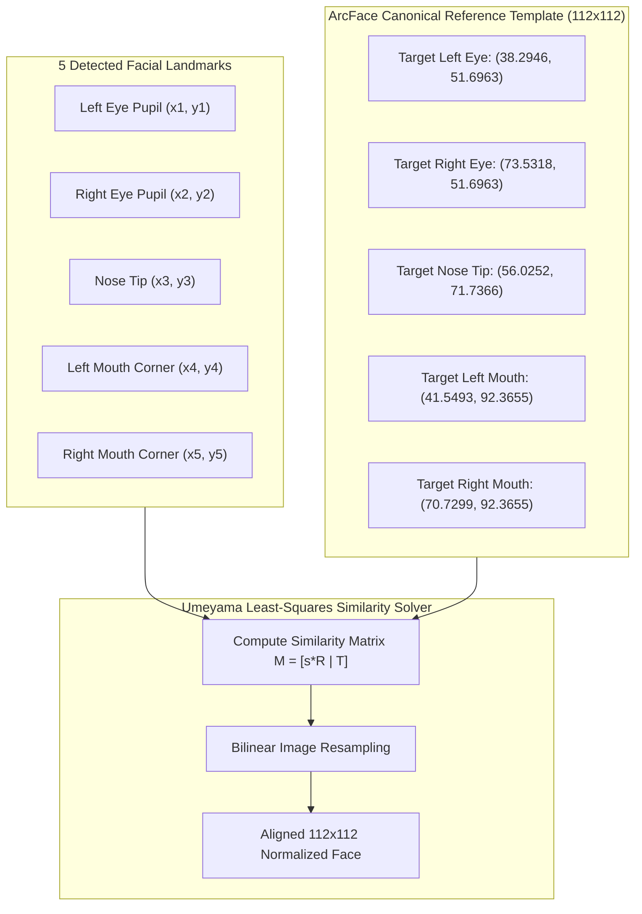

# Face Detection, Tracking & Landmark Alignment

This document explains the computer vision algorithms responsible for real-time face detection, 5-point facial landmark extraction, coordinate space transformations, and affine similarity alignment in **FaceScan**.

---

## 1. Vision Engine & ML Kit Integration

Face detection in FaceScan is powered by Google ML Kit Vision running directly on the device GPU/NPU via Android CameraX:



### Detection Operating Modes
- **Fast Mode (`FaceDetectorMode.fast`)**: Used in [`app/index.native.tsx`](file:///c:/Users/Ayush%20Kumar/Desktop/FaceC/app/index.native.tsx) for continuous attendance scanning. Skips deeper landmark meshes to minimize thermal throttling and sustain 30 FPS.
- **Accurate Mode (`FaceDetectorMode.accurate`)**: Used in [`app/(tabs)/enroll.tsx`](file:///c:/Users/Ayush%20Kumar/Desktop/FaceC/app/(tabs)/enroll.tsx) during student registration. Maximizes sub-pixel landmark precision to ensure the initial facial embedding centroid is mathematically pure.

---

## 2. Coordinate Spaces & The Front-Camera Mirroring Trap

One of the most complex challenges in mobile computer vision is mapping coordinates across multiple asynchronous coordinate spaces:


### The Front-Camera Mirroring Trap
When using the selfie camera, users expect the preview to behave like a mirror: moving their head to their right should move the preview to the right. However:
1. The camera sensor records an **un-mirrored** raw image.
2. If JavaScript attempts to mirror the bounding box when the native module has already mirrored coordinates, the bounding box flies in the opposite direction of the face!
3. **The FaceScan Solution**:
   - The native library ([`CameraView.kt`](file:///c:/Users/Ayush%20Kumar/Desktop/FaceC/node_modules/react-native-face-detector-camera/android/src/main/java/com/facedetectorcamera/CameraView.kt)) **always mirrors `x`** before emitting the event to React Native when on the front camera:
     $$\text{face.x} = \text{imageWidth} - \text{face.x} - \text{face.width}$$
   - Consequently, in [`utils/faceBoxUtils.ts`](file:///c:/Users/Ayush%20Kumar/Desktop/FaceC/utils/faceBoxUtils.ts), JavaScript explicitly computes `mapFaceToPreview(face, preview, mirrored = false)`.

### Aspect Ratio "Cover" Projection
The camera aspect ratio (typically 4:3 or 16:9) rarely matches the mobile screen viewport (often 19.5:9 or 20:9). We apply a uniform "cover" scaling matrix:

$$\text{scale} = \max\left(\frac{\text{preview.width}}{\text{face.imageWidth}}, \frac{\text{preview.height}}{\text{face.imageHeight}}\right)$$

$$\text{offsetX} = \frac{\text{preview.width} - (\text{face.imageWidth} \times \text{scale})}{2}$$

$$\text{offsetY} = \frac{\text{preview.height} - (\text{face.imageHeight} \times \text{scale})}{2}$$

$$\text{screenLeft} = \text{face.x} \times \text{scale} + \text{offsetX}$$

$$\text{screenTop} = \text{face.y} \times \text{scale} + \text{offsetY}$$

---

## 3. 5-Point Affine Similarity Alignment (Umeyama Transform)

Raw bounding boxes cannot be directly passed to the ArcFace neural network: if the user tilts their head ($roll \ne 0$) or stands at varying distances, the neural network would need to be invariant to arbitrary 2D rotations and scales, reducing recognition accuracy.

To solve this, FaceScan employs **5-Point Affine Similarity Alignment**:



### Mathematical Formulation
Given source points $X = \{x_i\}_{i=1}^5$ and canonical destination points $Y = \{y_i\}_{i=1}^5$, the algorithm finds the optimal similarity transform parameters $(s, R, t)$ minimizing the mean squared landmark error:

$$\min_{s, R, t} \frac{1}{5} \sum_{i=1}^5 \| y_i - (s R x_i + t) \|^2$$

where:
- $s \in \mathbb{R}^+$ is the uniform scale factor.
- $R \in SO(2)$ is the 2D rotation matrix eliminating head tilt.
- $t \in \mathbb{R}^2$ is the 2D translation vector centering the eyes and nose.

The resulting warped patch is exactly $112 \times 112$ pixels, with the interpupillary distance fixed to **35.24 pixels** and the eye horizontal line perfectly parallel to the image grid.

---

## 4. Real-time UI Smoothing (`SmoothFaceBox`)

Directly rendering ML Kit bounding boxes at 30 FPS causes noticeable visual jitter due to camera sensor noise and pixel quantization.

FaceScan implements a high-stiffness spring damper using **React Native Reanimated**:

```tsx
const springConfig = {
  stiffness: 240, // High stiffness ensures immediate zero-lag tracking
  damping: 20,    // Critically damped to eliminate oscillating overshoots
  mass: 0.3,      // Very low mass allows instantaneous response to rapid head movements
};

left.value = withSpring(previewFace.left, springConfig);
top.value = withSpring(previewFace.top, springConfig);
width.value = withSpring(previewFace.width, springConfig);
height.value = withSpring(previewFace.height, springConfig);
```

This ensures the green scanning box glides across the screen at a buttery 60 FPS while remaining locked onto the student's face.
