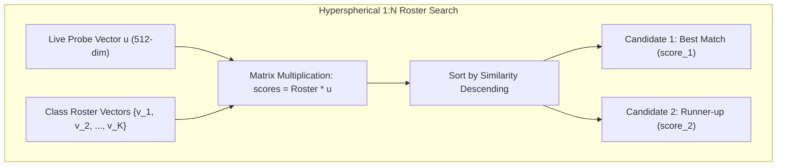
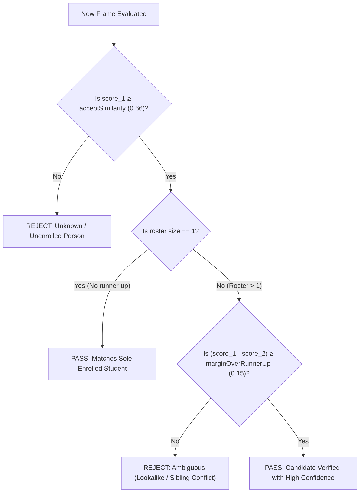
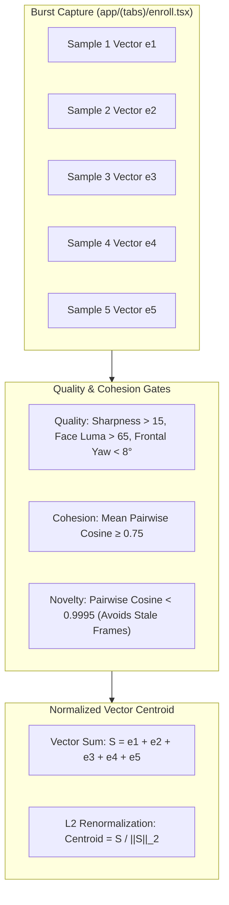
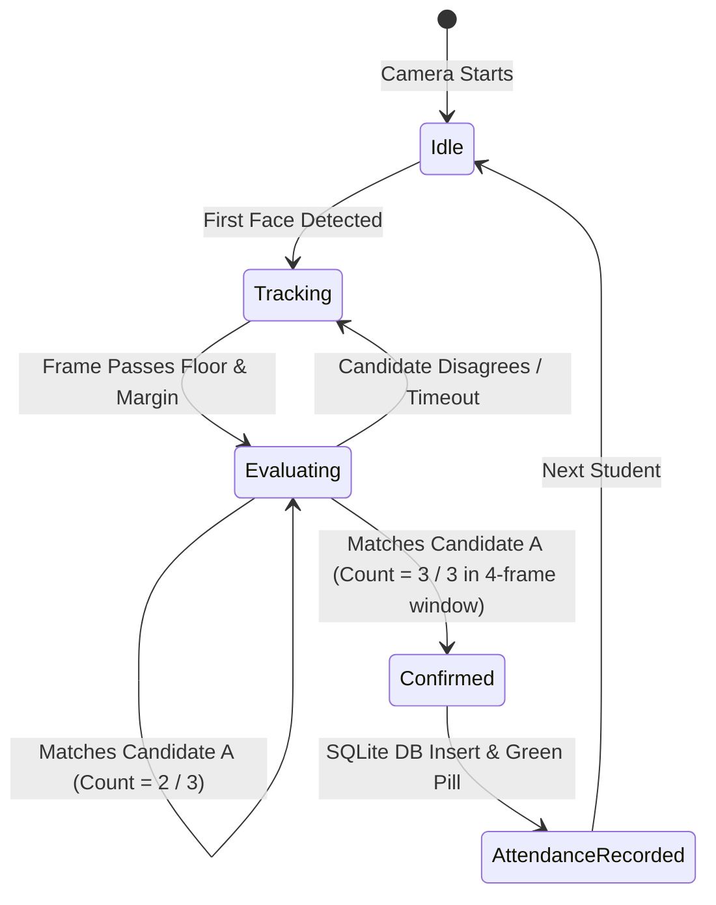

# Face Recognition & Metric Learning Pipeline

This document explains the deep metric learning, hyperspherical vector matching, margin testing, and temporal consensus algorithms that power student identification in **FaceScan**.

---

## 1. Deep Feature Extractor: ArcFace MobileFaceNet

Face recognition in FaceScan maps a $112 \times 112$ aligned facial crop into a **512-dimensional embedding space** using the ArcFace (`w600k_mbf`) deep neural network.

```mermaid
graph LR
    subgraph InputCrop["1. Aligned Input"]
        NormCrop["112x112 Normalized Face Crop"]
        RGB["RGB Channel Order & Float Normalization"]
    end

    subgraph MobileFaceNet["2. ArcFace Backbone (MobileFaceNet)"]
        Conv1["Initial 3x3 Conv + PReLU"]
        DWConv["Inverted Residual Blocks (Depthwise Separable)"]
        GDConv["Global Depthwise Convolution Layer"]
        FC["512-dim Linear Dense Projection"]
    end

    subgraph Normalization["3. Hypersphere Projection"]
        L2Norm["L2 Unit Vector Normalization (||v|| = 1.0)"]
        Embedding["512-dimensional Biometric Vector ∈ S^511"]
    end

    NormCrop --> RGB
    RGB --> Conv1
    Conv1 --> DWConv
    DWConv --> GDConv
    GDConv --> FC
    FC --> L2Norm
    L2Norm --> Embedding
```

### Additive Angular Margin Loss (ArcFace)
During training, ArcFace introduces an additive angular margin $m$ directly into the target angle $\theta_{y_i}$:

$$L_{\text{ArcFace}} = -\frac{1}{N} \sum_{i=1}^N \log \frac{e^{s \cos(\theta_{y_i} + m)}}{e^{s \cos(\theta_{y_i} + m)} + \sum_{j \ne y_i} e^{s \cos \theta_j}}$$

where $s$ is the hypersphere radius scale factor and $m$ is the angular margin penalty. This enforces maximal intra-class compactness and inter-class discrepancy on the surface of the 512-dimensional hypersphere $\mathbb{S}^{511}$.

---

## 2. Hyperspherical Cosine Similarity & Vector Matching

Because all ArcFace embeddings are $L_2$-normalized ($\|\mathbf{u}\|_2 = 1.0$ and $\|\mathbf{v}\|_2 = 1.0$), the cosine similarity between two face vectors is simply their **dot product**:

$$\cos(\theta) = \frac{\mathbf{u} \cdot \mathbf{v}}{\|\mathbf{u}\|_2 \|\mathbf{v}\|_2} = \mathbf{u} \cdot \mathbf{v} = \sum_{k=1}^{512} u_k v_k$$

The relationship between cosine similarity and Euclidean ($L_2$) distance is linear in cosine space:

$$d_{L_2}^2(\mathbf{u}, \mathbf{v}) = \|\mathbf{u} - \mathbf{v}\|_2^2 = \|\mathbf{u}\|^2 + \|\mathbf{v}\|^2 - 2(\mathbf{u} \cdot \mathbf{v}) = 2(1 - \cos(\theta))$$

---

## 3. The Dual-Stage Margin Decision Engine

A common mistake in biometric systems is relying solely on an absolute threshold. If a system accepts anyone with $\text{similarity} > 0.60$, a lookalike or sibling might score $0.62$ and be falsely identified.

FaceScan employs a **Two-Stage Decision Gate**:

### Empirical Calibration Metrics ([`MATCH_TUNING`](file:///c:/Users/Ayush%20Kumar/Desktop/FaceC/utils/faceMatching.ts))
Derived from 2,042 multi-subject camera comparison frames across diverse lighting:

| Distribution | Minimum | 5th Percentile | Median | Maximum |
| :--- | :--- | :--- | :--- | :--- |
| **Genuine Comparisons** | **0.717** | **0.760** | **0.831** | **0.891** |
| **Impostor Comparisons** | **0.299** | — | **0.428** | **0.515** |

Notice that the genuine and impostor distributions **do not overlap**: the worst genuine score (0.717) clears the highest impostor score (0.515) by **0.202**.

1. **`acceptSimilarity = 0.66`**: Sits comfortably between the impostor maximum (0.515) and genuine 5th percentile (0.760), allowing genuine students in uneven room lighting to verify while blocking strangers.
2. **`marginOverRunnerUp = 0.15`**: Ensures the winner beats the second-best candidate by at least 0.15, completely eliminating sibling and lookalike confusion.

---

## 4. Biometric Centroid Averaging (Enrollment)

In single-shot enrollment systems, an accidental squint, shadow, or camera blur during registration permanently degrades matching performance.

FaceScan solves this through **Biometric Centroid Averaging**:

$$\mathbf{C} = \frac{\sum_{i=1}^5 \mathbf{e}_i}{\left\| \sum_{i=1}^5 \mathbf{e}_i \right\|_2}$$

By averaging 5 high-quality vectors, idiosyncratic zero-mean Gaussian sensor noise cancels out, producing a clean, noise-free representation of the student's facial identity.

---

## 5. Multi-Frame Consensus Tracker (`ConsensusTracker`)

Even with robust thresholding, mobile camera streams can experience brief anomalies (such as extreme motion blur or a bystander stepping into the background).

To achieve zero false positives, [`ConsensusTracker`](file:///c:/Users/Ayush%20Kumar/Desktop/FaceC/utils/faceMatching.ts) implements an **$M$-of-$N$ sliding temporal window**:

### Consensus Rules
- **Window Size ($N = 4$)**: Looks at the last 4 consecutively processed frames.
- **Required Consensus ($M = 3$)**: At least 3 of those 4 frames must agree on the identical student ID.
- **Result**: Instantaneous 1-frame mismatches are completely filtered out before attendance is marked.
