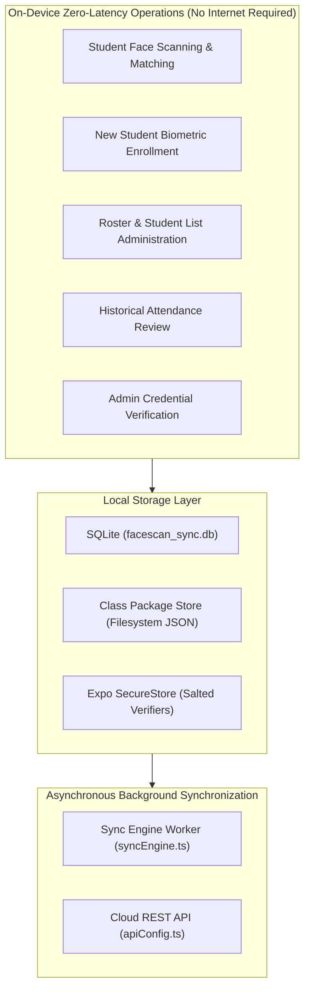
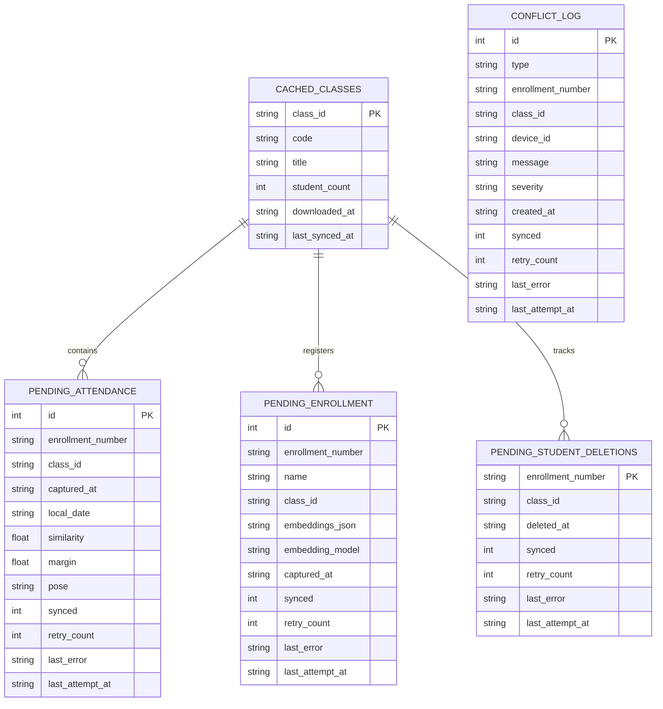
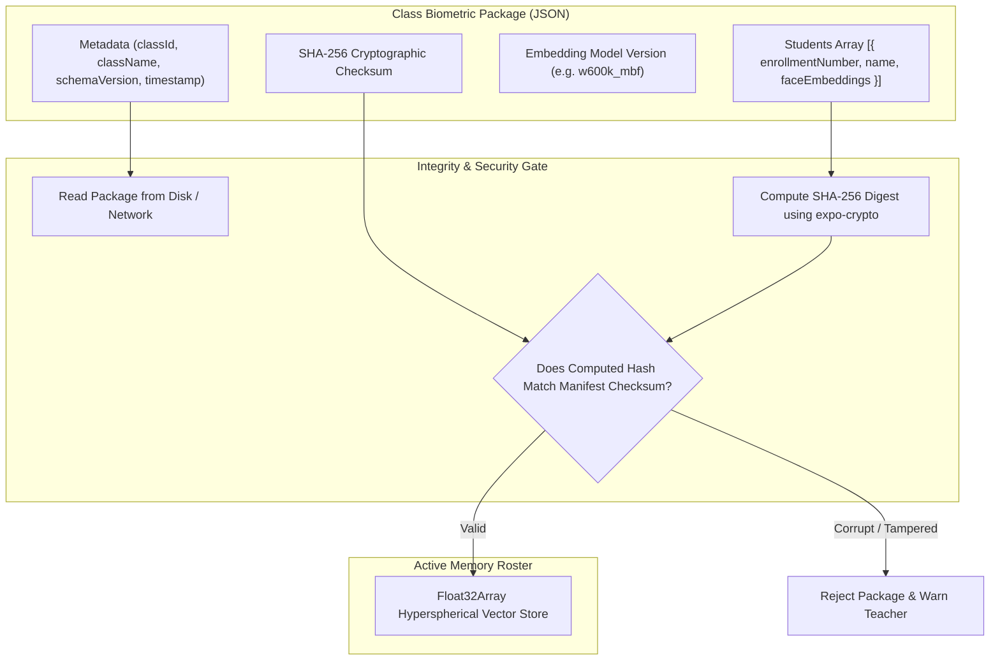
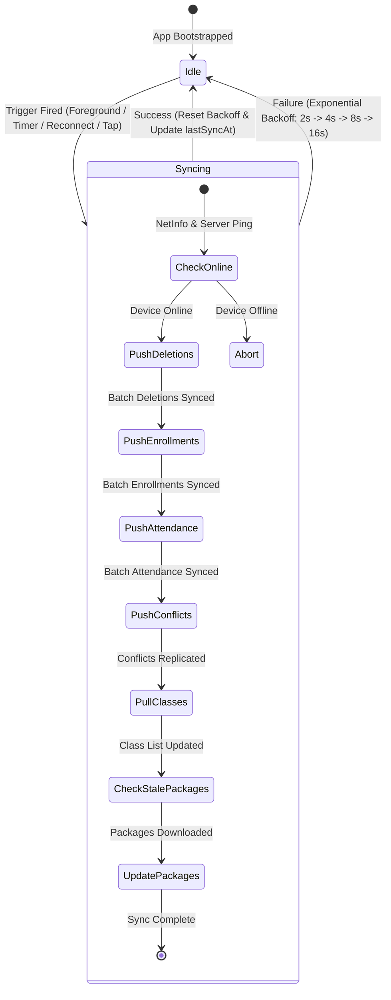

# Offline Storage, Biometric Packages & Sync Engine

This document details the offline-first data architecture of **FaceScan**, including the local SQLite database, on-device biometric package distribution, SHA-256 integrity verification, and the background synchronization engine.

---

## 1. Offline-First Philosophy

In educational and enterprise environments, network connectivity can be unreliable, intermittent, or unavailable. FaceScan is engineered with a strict **Offline-First Contract**:

1. **Zero-Latency Attendance**: Face recognition and matching run 100% on-device. Scanning a student never requires a network call.
2. **Immediate Local Persistence**: Check-ins and enrollments are written to SQLite within **5 milliseconds**.
3. **Immediate Scan-After-Enroll**: A student enrolled offline is instantly recognizable on the same phone without contacting the server.

---

## 2. Local SQLite Database Schema

The local relational database is managed by [`utils/localDb.ts`](file:///c:/Users/Ayush%20Kumar/Desktop/FaceC/utils/localDb.ts) using `expo-sqlite`:

---

## 3. On-Device Biometric Packages (`classPackageStore.ts`)

To enable instant face matching without requesting vectors over the network, class rosters are compiled into immutable, self-contained **Biometric Packages**:

### The Unified Roster Algorithm (`getUnifiedClassRoster`)
How does a teacher enroll a new student in a remote classroom without internet and immediately take their attendance?
1. The on-disk package contains previously downloaded students.
2. The SQLite table `pending_enrollment` contains newly registered students whose vectors have not yet reached the server.
3. The table `pending_student_deletions` contains any students removed offline.
4. [`getUnifiedClassRoster()`](file:///c:/Users/Ayush%20Kumar/Desktop/FaceC/utils/classPackageStore.ts) performs a **dynamic union**:
   $$\text{Active Roster} = (\text{Downloaded Package} \cup \text{Pending Enrollments}) \setminus \text{Pending Deletions}$$

---

## 4. Background Sync Engine (`syncEngine.ts`)

Replication between device SQLite tables and the cloud server is managed asynchronously by [`utils/syncEngine.ts`](file:///c:/Users/Ayush%20Kumar/Desktop/FaceC/utils/syncEngine.ts):

### Sync Trigger Points
1. **App Foregrounding**: `AppState.addEventListener('change')` triggers an immediate sync whenever the app is brought to the foreground.
2. **Network Reconnection**: `NetInfo.addEventListener` detects transitions from offline to online.
3. **Safety Timer**: A background interval fires every **2 minutes** as a safety net.
4. **Session Guard (`scanningSessionActive`)**: Crucially, while a teacher is actively scanning faces on the camera screen, the sync engine **suppresses network activity**. This prevents background HTTP requests from causing frame drops on the CameraX thread.

---

## 5. Offline Encrypted Admin Authentication (`adminAuth.ts`)

Administrators must be able to log in and configure settings even in dead zones.
- Storing plaintext passwords on the mobile device is a severe security vulnerability.
- **The FaceScan Solution**:
  - When the admin logs in successfully online, [`rememberOfflineAdminCredentials`](file:///c:/Users/Ayush%20Kumar/Desktop/FaceC/utils/adminAuth.ts) generates a random 16-byte cryptographic salt and computes:
    $$\text{verifier} = \text{SHA-256}(\text{username} \,\|\, \text{password} \,\|\, \text{salt})$$
  - The salted verifier and salt are stored in encrypted hardware storage using **Expo SecureStore**.
  - When offline, [`verifyOfflineAdminCredentials`](file:///c:/Users/Ayush%20Kumar/Desktop/FaceC/utils/adminAuth.ts) hashes the user's typed credentials against the stored salt and compares digests in constant time. Plaintext passwords are never written to disk.
