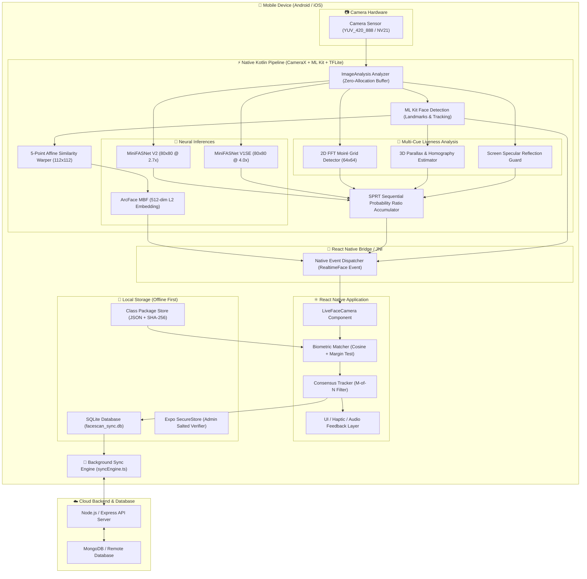

# FaceScan Technical Documentation & Engineering Knowledge Base

Welcome to the comprehensive technical documentation for **FaceScan** — a high-performance, enterprise-grade, offline-first mobile face detection, biometric recognition, and anti-spoofing attendance system built with React Native, Expo, Kotlin CameraX, ML Kit, and TensorFlow Lite.

---

## 📚 Documentation Index

| Document | Description | Key Topics |
| :--- | :--- | :--- |
| **[System Architecture](file:///c:/Users/Ayush%20Kumar/Desktop/FaceC/docs/ARCHITECTURE_OVERVIEW.md)** | End-to-end system design & data flow | CameraX analyzer, native C++/Kotlin pipeline, React Native bridge, SQLite, and cloud synchronization |
| **[Face Detection & Alignment](file:///c:/Users/Ayush%20Kumar/Desktop/FaceC/docs/FACE_DETECTION.md)** | Real-time face detection & normalization | ML Kit vision integration, coordinate mapping, front-camera mirroring, 5-point affine landmark alignment |
| **[Face Recognition & Matching](file:///c:/Users/Ayush%20Kumar/Desktop/FaceC/docs/FACE_RECOGNITION.md)** | Deep metric learning & biometric identification | ArcFace MobileFaceNet (512-dim), hyperspherical cosine distance, margin testing, lookalike mitigation, consensus tracking |
| **[Anti-Spoofing & Liveness](file:///c:/Users/Ayush%20Kumar/Desktop/FaceC/docs/ANTI_SPOOFING.md)** | Multi-cue presentation attack detection (PAD) | Dual MiniFASNet ensemble, 2D FFT moiré grid analysis, 3D parallax residuals, SPRT sequential probability ratio testing |
| **[Offline Storage & Sync Engine](file:///c:/Users/Ayush%20Kumar/Desktop/FaceC/docs/OFFLINE_SYNC_AND_STORAGE.md)** | Offline-first database & cloud replication | SQLite localDb schema, biometric class packages, SHA-256 integrity, sync engine triggers, conflict resolution |

---

## 🎯 Architecture at a Glance

---

## 🔬 Core Technologies & Standards

- **Deep Learning Backbones**:
  - ArcFace (`w600k_mbf` MobileFaceNet): 512-dimensional normalized hypersphere embeddings for zero-shot recognition.
  - MiniFASNet V2 (`minifasnetv2_80` @ 2.7x scale) & MiniFASNet V1SE (`minifasnetv1se_80` @ 4.0x scale): Dual-scale contextual spoof rejection.
- **Computer Vision**:
  - Google ML Kit Vision: Fast 60 FPS face detection, contour detection, and 5-point landmark localization (eyes, nose, mouth corners).
  - OpenCV / Native Matrix Warping: Umeyama similarity transform alignment.
  - 2D Discrete Fast Fourier Transform (FFT) on 64x64 patches for spatial frequency domain screen moiré detection.
- **Statistical Decision Theory**:
  - Abraham Wald's **Sequential Probability Ratio Test (SPRT)** for optimal multi-frame hypothesis testing with calibrated error bounds ($\alpha = 0.001$, $\beta = 0.01$).
- **Mobile Platform**:
  - React Native 0.76+ & Expo 52.
  - Jetpack CameraX & Kotlin Coroutines for zero-allocation high-speed camera streaming.
  - SQLite with Write-Ahead Logging (WAL) for transactional local queue persistence.

---

## 🛠️ Testing & Verification Tools

The repository includes a rigorous verification suite located in [`scripts/`](file:///c:/Users/Ayush%20Kumar/Desktop/FaceC/scripts):
1. **[run_golden_tests.py](file:///c:/Users/Ayush%20Kumar/Desktop/FaceC/scripts/run_golden_tests.py)**: Golden test regression suite validating tensor contracts, numerical stability, FFT math, 3D parallax residuals, and upstream PyTorch equivalence.
2. **[calibrate_anti_spoof.py](file:///c:/Users/Ayush%20Kumar/Desktop/FaceC/scripts/calibrate_anti_spoof.py)**: Offline SPRT simulation runner for captured real-world device logs.
3. **[diagnose_crop_geometry.py](file:///c:/Users/Ayush%20Kumar/Desktop/FaceC/scripts/diagnose_crop_geometry.py)**: Crop margin geometry test validating ML Kit to RetinaFace spatial transformations.
4. **[convert_v1se_to_tflite.py](file:///c:/Users/Ayush%20Kumar/Desktop/FaceC/scripts/convert_v1se_to_tflite.py)**: PyTorch to ONNX to TensorFlow Lite model export script.
